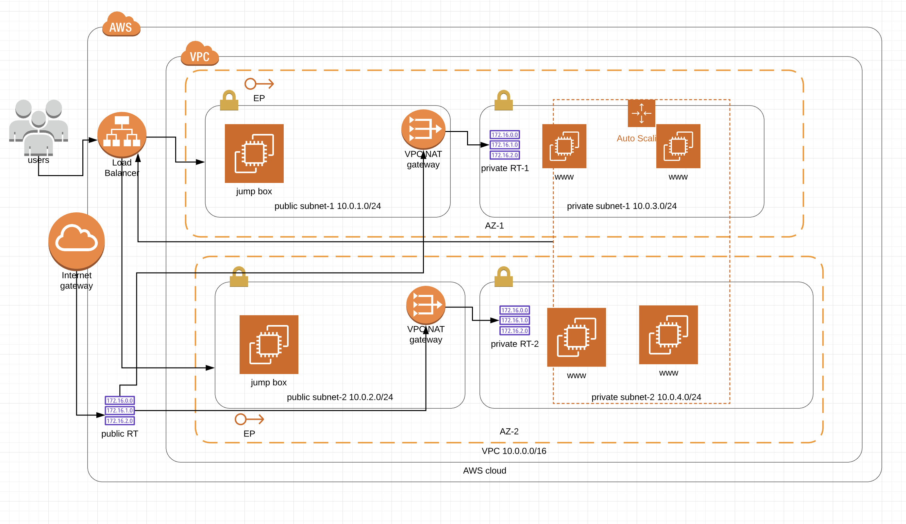

# AWS Load Balancer Terragrunt

This repository contains Terraform modules and configurations for managing AWS load balancers using Terragrunt.

## Overview

This project aims to provide reusable Terraform modules to simplify the deployment and management of AWS load balancers across different environments. It leverages Terragrunt for managing infrastructure as code (IaC) and provides a modular structure for easy customization and maintenance.

## Infrastructure Diagram



The infrastructure diagram illustrates the architecture of the deployed application, including the networking components, load balancers, auto-scaling groups, and other relevant AWS services.

## Features

- Modular Terraform configurations for different types of AWS load balancers.
- Support for provisioning and configuring load balancers with customizable settings.
- Environment-specific configurations using Terragrunt.

## Getting Started

To use these Terraform modules and configurations, follow these steps:

1. Clone the repository:

   ```bash
   git clone https://github.com/minaroid/aws-load-balancer-terragrunt.git
   ```

2. Navigate to the desired environment directory (development or production).
3. Modify the Terragrunt configuration files (terragrunt.hcl) and Terraform variables as needed for your environment.
4. Run Terragrunt commands to apply the configurations:

```bash
terragrunt run-all init
terragrunt run-all plan
terragrunt run-all apply
```
## Directory Structure

The repository follows the following directory structure:

development/: Contains development environment-specific Terragrunt configurations.
production/: Contains production environment-specific Terragrunt configurations.
modules/: Contains reusable Terraform modules for managing AWS load balancers.

## Contributing

Contributions to this project are welcome! Feel free to submit bug reports, feature requests, or pull requests to help improve this project.


## License

This project is licensed under the MIT License.


This README template is tailored to your specific environment setup, with directories for `development` and `production`. You can further customize it according to your project's specific details and requirements.
